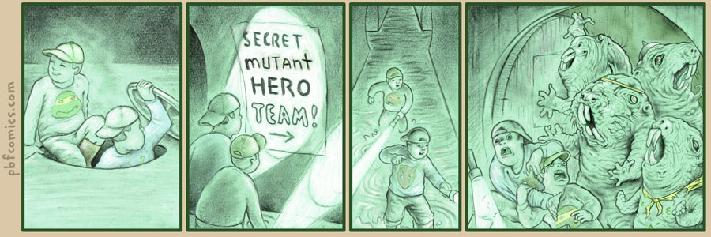
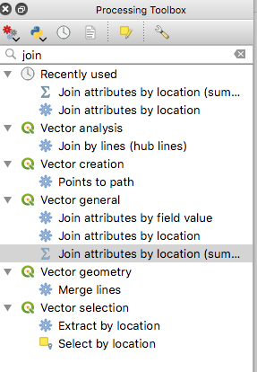
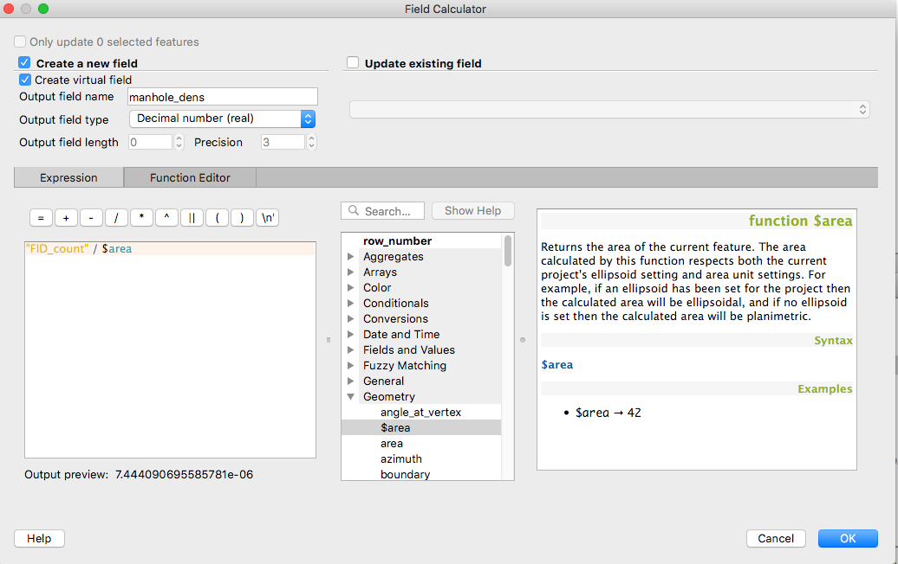
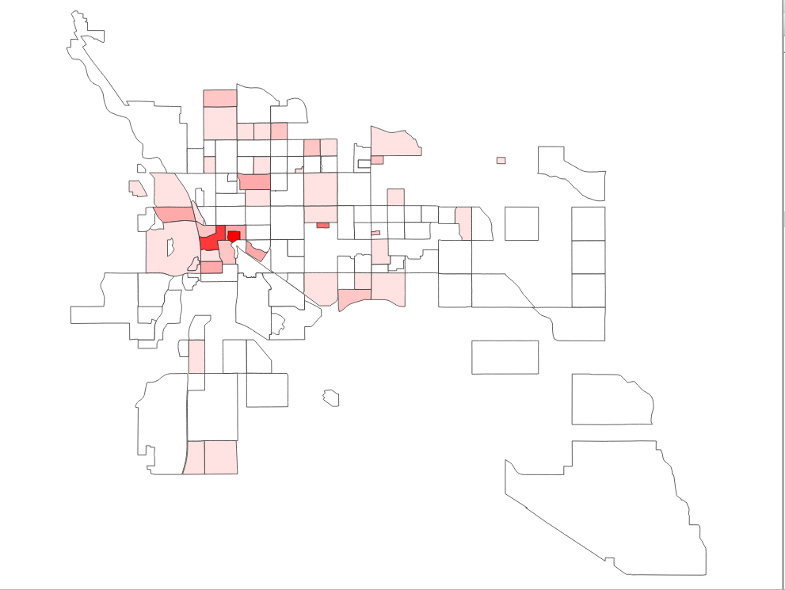

# Lab: Secret Mutant Hero Team Map
## Worth: 40
## Due: October 10, 2019, 11:59pm
## Assignment

### Overview
Recent reports of mutant creatures emerging from Tucson's sewer pipes at night has prompted a local realtor to hire 
you to conduct a Geospatial Analysis to identify the neighborhoods most at risk of encountering these mutant creatures 
while walking around the neighborhood at night. While there have been no negative incidents associated with the creatures, 
some residents have reported feeling uneasy at their presence. On the other hand, some officers from the Tucson Police 
Department have anecdotally reported that crime has actually decreased in locations where they have been found. 

You will use the City of Tucson's Open GIS Data to conduct this analysis. The City of Tucson makes their GIS Data publicly available for download but also available for consumption as web services. 

### Objective
Find the neighborhoods with the highest density of man hole covers.

### Source Data
You will use two layers from the [City of Tucson's Open GIS Datasets](http://gisdata.tucsonaz.gov/) to conduct this analysis.
The data are summarized below:
- [Man Holes](http://gisdata.tucsonaz.gov/datasets/60a2bb58e8054bee8562127bfa0d9fc1_9)
- [Neighborhood Associations](http://gisdata.tucsonaz.gov/datasets/828d637891e94d95a2e62cf62ad2f7e0_0)

#### Data Instructions
Use the links above to find the landing page for each of the datasets or find the data using the Search feature on the [City of Tucson GIS Open Data website](http://gisdata.tucsonaz.gov/) using the search terms "Man holes" and "Subdivisions". The following instructions are for Man Holes but can be applied to any of the City of Tucson's Open Data datasets:

1. Open the "Man Holes - Open Data" page and look for a Drop-down for "APIs" -- Click this and select the link listed under "GeoJSON".
2. In QGIS, select "Layer" from the Menu Bar, then "Add Layer" -> "Add Vector Layer". 
3. For "Source Type", select "Protocol: HTTP(S), cloud, etc.)
4. For Protocol, select "GeoJSON" and paste the URI you copied from the City of Tucson's website. 
5. Click "Add" to add to add the data to your QGIS project. 
6. It will have an unreadable name, so right click on the Layer in the Layer Menu and Rename it to "Man Holes".

Repeat for Neighborhood Assocations.

### Strategy
The overall goal is to identify the density of manhole covers within each subdivision. 

`Density = Count / Area`

Complications: The Man Holes data is a line feature showing the outline of each of the manholes. While it might make sense
to convert them directly to points, that will simply export the polygon boundaries as points and whwn you calculate density, you will get different (and wrong) results if some man holes were digitized were more precision than others (or if they are simply bigger). The metric you want with man hole covers is `Count`. 

I suggest:
1. Polygonize the Lines to create closed polygon features for the Man Holes
2. Find centroids of the polygons

Another complication: The Source Data is in EPSG:4326, a lat/long coordinate reference system which uses units `degrees`, making measurement impractical at the city scale. You will need to reproject the source data into a coordinate reference system in which distance is preserved. I suggest UTM Zone 12, NAD83 HARN (aka `EPSG:102206`). 

1. Reproject both input layers to a UTM NAD83_HARN projection.

### Key QGIS Tutorial for reference
While you would and should be tempted to perform a spatial join as in http://www.qgistutorials.com/en/docs/performing_spatial_joins.html, doing so raises a common side effect of using open source software and of using publicly available tutorials. 
This tutorial was written for a previous version of QGIS. The work flow for QGIS 3 is slightly different. Follow the tutorial as it is written but when you get to step 8, which asks you to `Join attributes by location`, you can easily get 
sucked into the vortex of using a look-alike tool that does not do what you want to summarize the intersection features of the join layer. That is, you want to `Sum` all the man hole covers within each `neighborhood association` but the default Menu Item in QGIS (`Vector` -> `Data Management Tools` -> `Join attributes by location`) does not give you the option to summarize the man hole covers. Instead, use the `Processing Toolbox` and search for `join`. Look for the option labeled `Join attributes by location (summary)`

The projection must be in a metric like UTM in order for density calculation to work. To calculate density (`Density = Count / Area`), open the Attribute Table and open the Field Calculator. Use the middle panel to search for Fields and Functions to help you find the right syntax. The final calculation will look like this:

### Visualization
Calculate the density of the manhole covers by neighborhood and use a `Graduated` symbology to classify the density field into 10 classes. Use any color scheme that you like. When you click `Apply` you should get a map like this:

### Summary File
The realtor is most interested in the five neighborhoods with the densest coverage of man hole covers. Open the attribute table, click on the column that you created for `density` and sort it descending. Select the top five rows by clicking on the header at the left of the row. The selected rows should turn yellow. Right click on the layer in the `Layers` panel and `Export` the layer, choosing the `CSV` format. This file will be included in your deliverable below:

### Deliverables
Create a branch on this repo named `manholes`, add the two files below, and submit a PR to the `master` branch
1. Screenshot of the manhole density by neighborhood map named `manhole_density_map.png`
2. CSV file containing the attributes of the five neighborhoods with the highest density of man hole covers.

Be sure to send the instructor a message in slack with a link to your Pull request to initiate the grading process.
